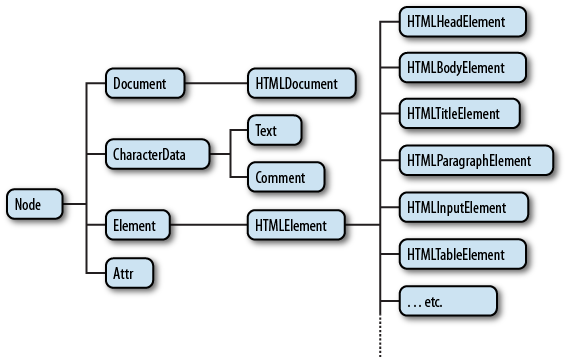
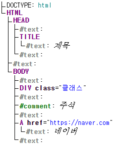

# BOM과 DOM 정리

## BOM (Browser Object Model)

### BOM 정의

브라우저의 창이나 프레임을 프로그래밍 적으로 제어할수 있게 해주는 객체모델

전역객체로 `window` 가 있으면 하위로
`location,navigator,document,screen,history` 가 포함

## DOM (Document Object Model)

### DOM 정의

웹페이지를 프로그래밍적으로 제어할수 있게 해주는 객체모델

최상위 인터페이스로 `Node` 가 있음



[이미지 출처](https://web.stanford.edu/class/cs98si/slides/the-document-object-model.html)

 \* 웹페이지를 트리 구조의 객체들로 표현한 모델 도큐먼트 트리



```javascript
// Element Node (태그)
const divElement = document.querySelector('div');

// Text Node (텍스트 내용)
const textNode = divElement.firstChild;

// Attribute Node (속성)
const classAttr = divElement.getAttributeNode('class');
```

## VirtualDom

```javascript

// 컴포넌트
// VirtualDOM 을 생성하는 팩토리
function Component(){
    return <div>Hello</div>;
}

// 실제로는 javascript 객체 트리
// Bom 의 사본 
const virtureNode = {
    type:'div',
    props:{
        children:'Hello'
    },
    key:null,
    ref:null
}
```

## 참고

- [Javascript.info, DOM 트리](https://ko.javascript.info/dom-nodes)
- [생활코딩, 웹브라우저와 자바스크립트](https://opentutorials.org/course/1375)
