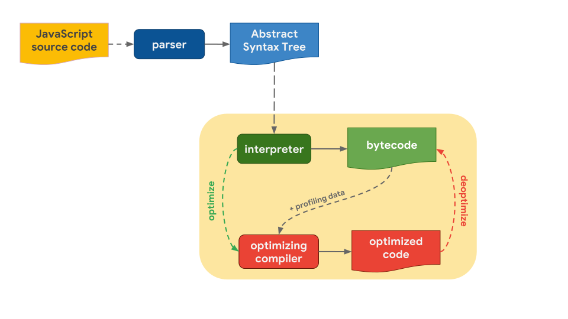

# 자바스크립트 엔진이 코드를 실행하는 과정

자바스크립트를 실행하기 위해선 자바스크립트 엔진이 필요하고 웹 브라우저는 자바스크립트 엔진을 내장하고 있다.

- V8
- SpiderMonkey
- Javascript core
  
  ## 실행과정

  
  [이미지 출처](https://mathiasbynens.be/notes/shapes-ics)

  - 소스코드를 만나면 파싱하여 AST(Abstract Syntax Tree) 로 변환
  - 인터프리터(Interpreter) 는 AST를 기반으로 바이트코드(Bytecode)를 생성 **(바이트코드 생성 및 실행)**
  - 인터프리터가 바이트코드를 실행할 때, 자주 사용되는 함수 및 타입 정보 등이 있는 프로파일링 데이터(Profiling data) 와 같이 최적화 컴파일러(Optimizing compiler) 에게 보낸다.
  - 최적화 컴파일러는 프로파일링 데이터를 기반으로 최적화된 코드(Optimized code)를 생성 한다.
  - 하지만, 프로파일링 데이터 중에 잘못된 부분이 있다면 최적화 해제(Deoptimize) 를 하고 다시 바이트코드를 실행해서 이전 동작을 반복한다.

### PHP 인터프리터 와 의 차이점

#### PHP

- 파싱
- 토큰화
- AST 생성
- 바이트코드 생성 (OPcache)
- Zend Engine이 바이트코드 직접 실행
  
#### javascript

- AST
- 바이트코드
- 프로파일링하면서 실행
- 핫스팟 감지시 → 네이티브 머신코드로 컴파일
  
`php` 와 `javascript` 둘다 바이트코드를 캐싱 하지만
`javascript` 는 바이트코드 + 머신코드로 컴파일 해서 캐싱 다음엔 캐시된 머신코드만 실행
캐싱 레벨이 다름
