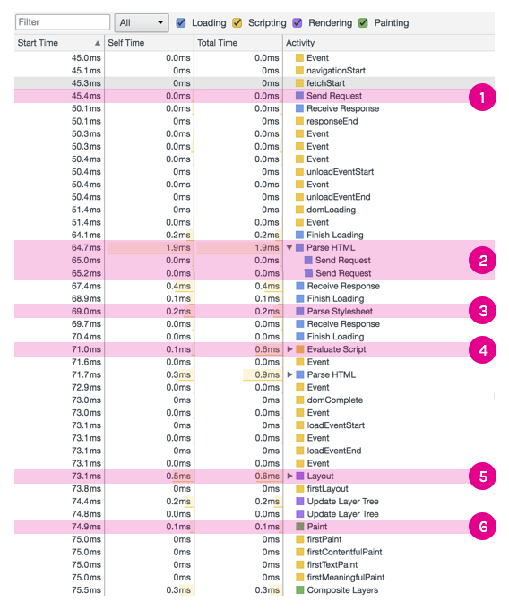

# 브라우저의 렌더링 원리

브라우저가 화면에 나타나는 요소를 렌더링 할 때, 웹킷(Webkit)이나 게코(Gecko) 등과같은 렌더링 엔진 을 사용한다. 렌더링 엔진이 HTML, CSS, Javascript로 렌더링할 때 CRP(Critical Rendering Path) 라는 프로세스를 사용하며 다음 단계들로 이루어진다.

## CRP (Critical Rendering Path)

1. **HTML 파싱 후, DOM(Document Object Model) 트리 구축**
2. **CSS 파싱 후, CSSOM(CSS Object Model) 트리 구축**
3. **Javascript 실행**
   * 주의! HTML 중간에 스크립트가 있다면 HTML 파싱이 중단된다.
4. **DOM과 CSSOM을 조합하여 렌더트리(Render Tree) 구축**
   * 주의! `display: none` 속성과 같이 화면에서 보이지도 않고 공간을 차지하지 않는 것은 렌더트리로 구축되지 않는다.
5. **뷰포트 기반으로 렌더트리의 각 노드가 가지는 정확한 위치와 크기 계산 (Layout/Reflow 단계)**
6. **계산한 위치/크기를 기반으로 화면에 그림 (Paint 단계)**

[이미지 출처](https://blog.asamaru.net/2017/05/04/understanding-the-critical-rendering-path/)

## 참고

[HTML Critical rendering path의 이해](https://blog.asamaru.net/2017/05/04/understanding-the-critical-rendering-path/)
