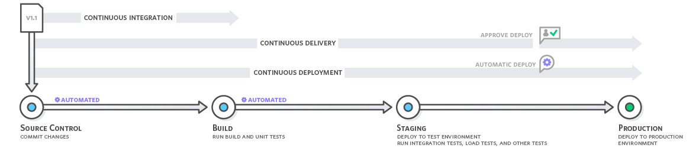

# CI & CD

## CI (Continuous Integration, 지속적 통합)

CI는 빌드와 테스트를 자동화해서 공유 저장소에 병합시키는 프로세스를 뜻한다.

빌드/테스트 자동화부터 코드의 일관성(Consistency)을 제공하기 때문에 지속적으로 통합한다는 용어를 사용하는 것이다.

## CD (Continuous Delivery/Deploy, 지속적 전달/배포)

CD는 CI의 빌드/테스트를 통해서 정상적으로 수행됨을 확인하면 이는 배포를 수동으로 하느냐 자동으로 하느냐에 따라 2가지로 나뉜다.

- 지속적 전달: 프로덕션 배포를 위한 상태가 되고 배포 자체는 수동으로 실행한다.
- 지속적 배포: 프로덕션까지 자동으로 배포한다.

CI/CD의 대표적인 서비스 **Jenkins, Travis CI, Circle CI**

[이미지 출처](https://aws.amazon.com/ko/devops/continuous-integration/)

## 참고 링크

- [AWS - 지속적 통합이란 무엇입니까?](https://aws.amazon.com/ko/devops/continuous-integration)
- [redHat - CI/CD 개념,방법,장점](https://www.redhat.com/ko/topics/devops/what-is-ci-cd)
