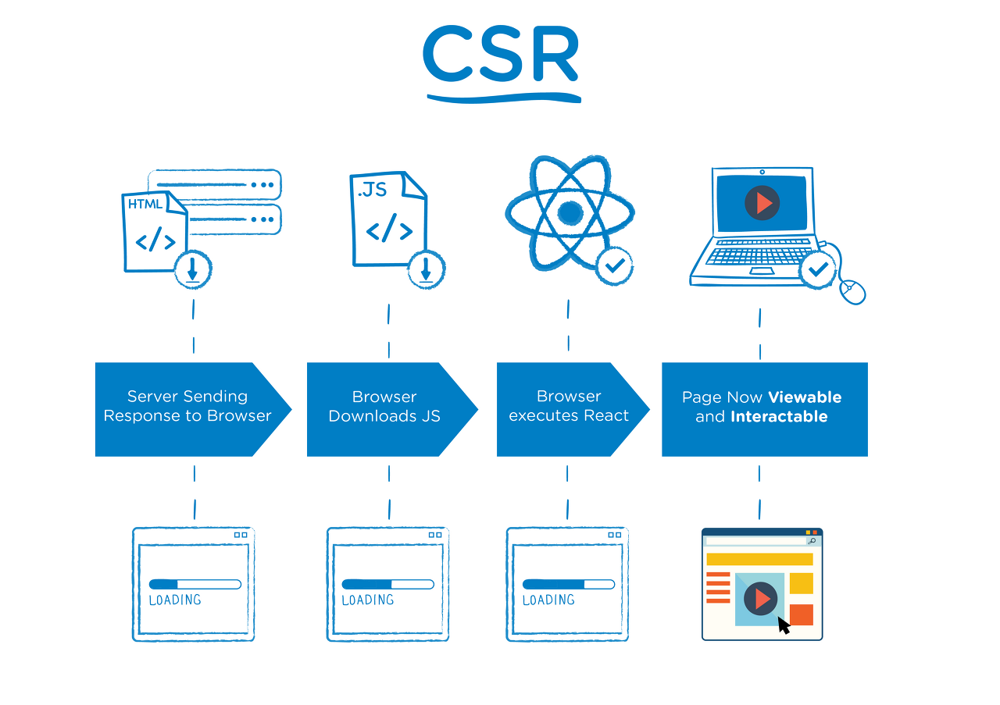
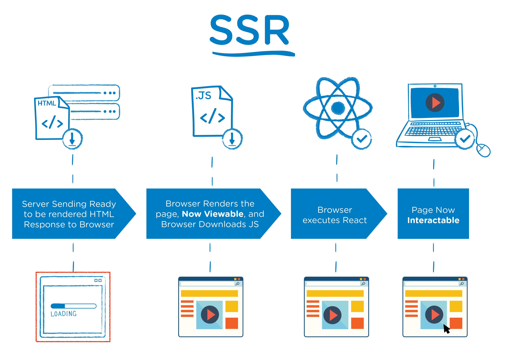
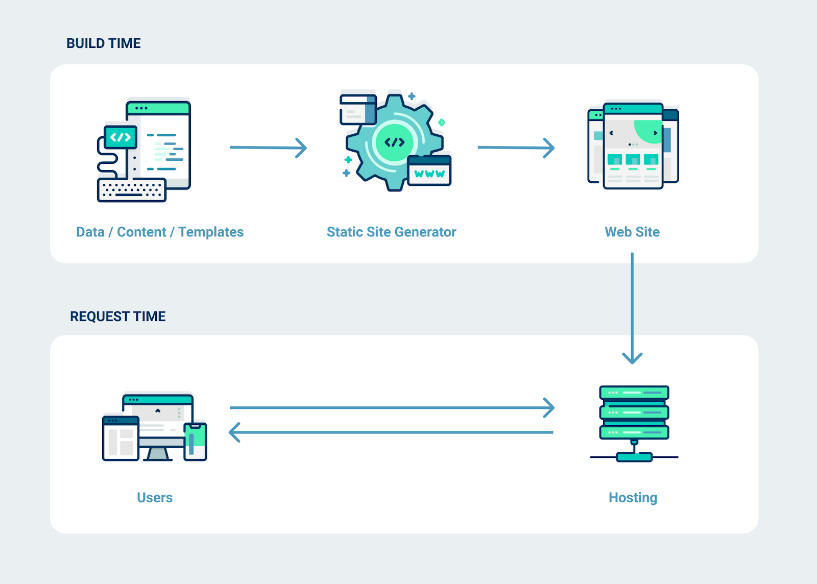

# CSR (Client-Side Rendering), SSR (Server-Side Rendering), SSG (Static Site Generation)

[이미지 출처](https://tech.weperson.com/wedev/frontend/csr-ssr-spa-mpa-pwa/#csr-client-side-rendering-vs-ssr-server-side-rendering)

## SPA / MPA

### SPA (Single Page Application)

하나의 HTML 파일을 기반으로 자바스크립트를 이용해 동적으로 화면의 컨텐츠를 바꾸는 방식의 웹 어플리케이션

- 사용자가 웹사이트 접속하면 서버는 빈 `html` 과 `javascript` 파일을 요청
- 브라우저가 `javascript` 를 로드 하고 실행
- `javascript`가 동적으로 `html`을 생성, 이를 브라우저에 표시
- 추가 페이지 요청시 전체 페이지를 다시 로드 하는 대신 필요한 데이터만 서버에 요청

#### SPA 장점

- 빠른 인터랙션 제공: 초기 로딩후 필요한 데이터만 서버에 요청 동적으로 페이지를 업데이트 그러므로 추가 페이지 로딩이 없음
- 서버 부하 감소: 전체 페이지를 매번 새로 렌더링 하지 않고 요청한 부분만 업데이트 하므로 서버 부담 감소

### SPA 단점

- 초기 로딩 속노 느림: 브라우저가 `javascript` 를 로드하고 실행하는 과정이 필요, 이 과정으로 인해 초기 로딩 속도가 느릴수 있음
- SEO취약: 브라우저가 `javascript`를 실행하여 동적으로 만드는데 이 과정에서 빈 `html` 파일이 먼저 화면에 보이기 때문에 웹 크롤러가 페이지 내용을 제대로 인식하지 못하여 SEO에 취약

### MPA (Multiple Page Application)

사용자가 페이지를 요청할 때마다, 웹 서버가 요청한 UI와 필요한 데이터를 HTML로 파싱해서 보여주는 방식의 웹 어플리케이션

- 사용자가 웹사이트에 요청
- 서버는 요청된 해당 페이지 를 브라우저에 전송
- 브라우저는 서버로 부터 받은 페이지를 모두 로드 하고 실행

### MPA 장점

- 초기 로딩속도빠름 서버에서 이미 구성된 `html` 브라우저에 전달
- SEO 유리 이미 구성된 `html` 을 제공 받기 때문에 웹크롤러가 정보 수집 용이

### MPA 단점

- 느린 인터랙션 사용자가 페이지 이동시 매번 새로운 파일을 로드
- 서버 부하 증가 매번 서버에서 로직을 실행하고 브라우저에 전송해야하므로 서버에 부담이 갈수 있음

## SSG(Static Site Genereation)

[이미지 출처](https://yong-nyong.tistory.com/)

빌드시 모든페이지를 `html` 파일로 미리 생성 하는 방식

- 빌드 시 서버는 모든 가능한 요청에 대한 `html`을 미리생성
- 사용자가 웹사이트에 접속 하면 서버는 미리 생성한 `html` 파일을 전송
- 브라우저는 서버에서 받은 `html` 을 표시
- 추가 페이지 요청시 미리 생성해 둔 해당 페이지의 `html` 을 전송

### SSG 장점

- 빠른 로딩 속도: 모든 페이지가 빌드 시에 미리 생성되므로, 사용자가 요청시 빠른 로딩속도를 제공
- 서버 부하 감소: 미리 생성된 `html` 만 제공하므로, 서버 부하가 적음

### SSG 단점

- 데이터 변경: 사이트 에서 데이터가 변경될때마다 전체 사이트를 다시 빌드 해야함
